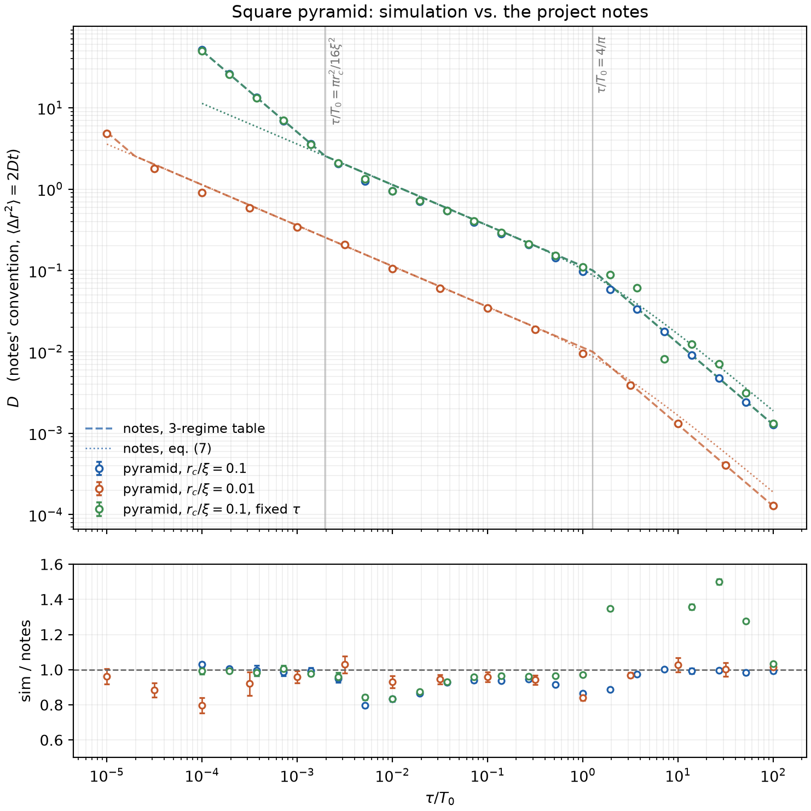
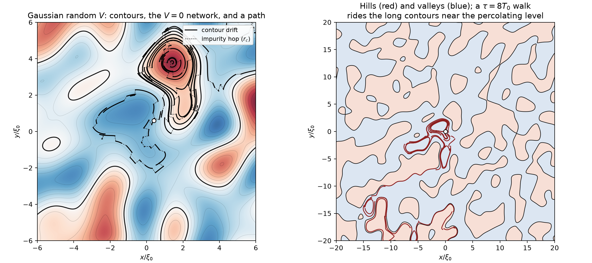
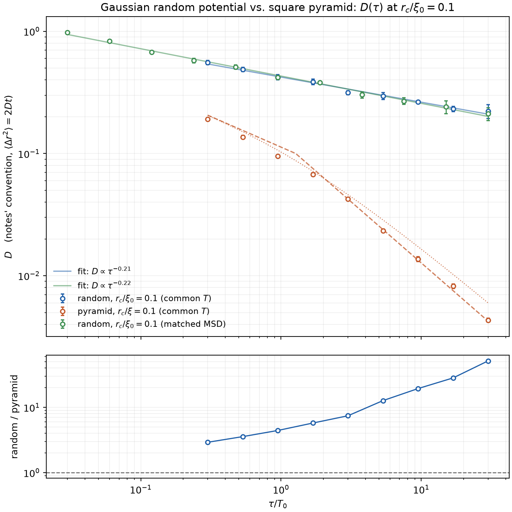

# Guiding-centre diffusion on a disordered / periodic potential

Simulation of electron diffusion in a 2-D potential landscape `V(x, y)` with a
perpendicular magnetic field `B = B ẑ`, in the regime where transport is a
sequence of **equipotential drifts interrupted by impurity scattering**.

## The model

In a strong field the cyclotron motion is fast and the guiding centre drifts with

```
v_d = (E × B)/B²  =  (ẑ × ∇V)/B ,        E = -∇V
```

which is everywhere perpendicular to `∇V`: the guiding centre **follows an
equipotential contour of V**, at speed `|∇V|/B`. An impurity collision randomises
the momentum, which re-centres the cyclotron orbit somewhere on the circle of
radius `r_c` around the electron — so the guiding centre **hops by `r_c` in a
random direction** and then follows whatever contour it landed on.

One elementary step of the walk is therefore

1. drift along the contour through `r` for a time `τ` (the mean free time, set by
   the impurity density),
2. hop `r → r + r_c (cos θ, sin θ)` with `θ` uniform on `[0, 2π)`.

Iterating and fitting the mean squared displacement gives the diffusion
coefficient in 2-D,

```
D = lim_{t→∞} ⟨|r(t) − r(0)|²⟩ / 4t .
```

## The square-pyramid landscape

The plane is tiled by unit cells `[i, i+1] × [j, j+1]`, each carrying a pyramid
whose apex is at the cell centre and which falls linearly to zero on the cell
edges, with alternating sign — a "pointy" `sin(πx) sin(πy)`:

```
V(x, y) = V₀ (−1)^(i+j) [ 1 − 2 max(|x − cx|, |y − cy|) / a ]
```

Every equipotential is an axis-aligned **square**, `|∇V| = 2V₀/a` is uniform (so
is the drift speed), and the zero level is the whole grid of cell edges — the
percolating network that joins hills to valleys through the saddles at the cell
corners.

Because the contours are squares traversed at constant speed, the drift step is
solved **in closed form**: map the point to its arclength along the square,
advance by `speed × τ` modulo the perimeter `8ℓ`, map back. One step, no
integration error, and no trouble at the pyramid ridges where `∇V` jumps by 90°.
That is `SquarePyramid.propagate`. For landscapes without such a closed form
(e.g. a random/disordered `V`) the base class `Potential.propagate` provides a
generic RK4 integrator with a Newton projection back onto the starting contour
after every substep, which conserves `V` to round-off; `Sinusoid` exercises it.

## Layout

```
mrdiff/potentials.py   landscapes + contour propagators (exact and generic)
mrdiff/theory.py       the project notes' analytic regimes, and conventions
mrdiff/walk.py         drift–kick walk, MSD, extraction of D
scripts/run_pyramid.py     sweep r_c at fixed B, write data/*.npz
scripts/plot_D_vs_rc.py    log-log plot of D(r_c)
scripts/plot_illustration.py  landscape + sample path + MSD curves
tests/test_physics.py  contour conservation, exact-vs-RK4, free-walk limit
```

## Running it

```
pip install numpy matplotlib
python scripts/run_pyramid.py            # ~5 min: the r_c sweep at B = 1, τ = 1
# optional ~11 min extension to r_c = 0.0125a (the runs get long as (a/r_c)^2)
python scripts/run_pyramid.py --rc-min 0.0125 --rc-max 0.0225 --n-rc 3 \
    --max-steps 1500000 --min-walkers 384 --seed 7000 \
    --out data/D_vs_rc_pyramid_small.npz
python scripts/plot_D_vs_rc.py           # figures/D_vs_rc_pyramid.png
python scripts/plot_illustration.py      # figures/pyramid_illustration.png

# D(tau): the notes' comparison, and the random potential
python scripts/run_tau_sweep.py --potential pyramid --rc 0.1 --collisions poisson
python scripts/run_tau_sweep.py --potential random --rc 0.1 --tau-min 0.3 \
    --tau-max 30 --n-tau 9 --n-real 5 --fixed-time 8000 --min-steps 200 \
    --min-walkers 800 --max-walkers 800
python scripts/plot_D_vs_tau.py --data data/D_vs_tau_*.npz --ratio --fit-power
python scripts/plot_random_illustration.py
python -m pytest tests -q
```

Units: `a = V₀ = B = τ = 1`, so lengths are in units of the pyramid size `a`,
`D` in units of `a²/τ`, and the drift speed is `2V₀/(aB) = 2`.

## Comparison with the project notes

`mrdiff/theory.py` encodes the analytic regimes of the notes (sections 1-5; the
Isichenko re-derivation of section 6 is deliberately left out). Two conventions
have to be lined up first:

* **Geometry.** In the notes `xi` is the pyramid *half*-width: cells are
  `2xi x 2xi`, adjacent apexes are `2xi` apart, `|grad V| = Gamma/xi`. In this
  code that is `SquarePyramid(V0=Gamma, a=2*xi)`.
* **Convention.** The notes define D through `<|dr|^2> = 2 D t`, i.e. their D is
  `Dxx + Dyy`. Everywhere else here D is the standard 2-D `<|dr|^2> = 4 D t`.
  So `D_notes = 2 D_here`.



**The three-regime table of the notes is confirmed.** Sweeping `tau` over six
decades at `r_c/xi = 0.1` and `0.01` (`xi = Gamma = B = 1`, so `v_d = 1` and
`T0 = xi/v_d = 1`), simulation/theory is:

| regime | notes | sim / notes |
|---|---|---|
| 1, `tau/T0 < pi r_c^2/16 xi^2` | `D = r_c^2/2 tau` | 0.99 - 1.03 |
| 2, up to `tau/T0 = 4/pi` | `D = 2 xi r_c/sqrt(pi T0 tau)` | 0.80 - 0.97 |
| 3, `tau/T0 > 4/pi` | `D = 4 xi r_c/(pi tau)` | 0.98 - 1.00 |

Regimes 1 and 3 come out to ~1%; the measured local log-log slopes are -1.0,
-1/2 and -1.0 as predicted, and the crossovers sit where the notes put them
(they move as `r_c^2`, which the two `r_c` curves confirm).

Two corrections to the notes came out of this:

1. **Collisions must be Poissonian.** The notes say the electron collides "on
   average after `tau`". Drifting for *exactly* `tau` is a different model: on a
   closed contour it is a rigid rotation repeated every step, which is not
   ergodic on the orbit, and it leaves visible commensurability artefacts once
   `tau > T0` (green points in the figure -- up to 1.5x off, and not monotonic).
   With exponential drift times of mean `tau`, regime 3 is reproduced to better
   than 1%. `simulate(..., collisions="poisson")` does this.
2. **Eq. (7) is wrong at large `tau`, and the `2/pi` in fig. 3 is exactly why.**
   Its own `tau >> T0` limit is `2 xi r_c/tau`, which is `pi/2` above regime 3.
   Multiplying by `2/pi` maps it onto `4 xi r_c/(pi tau)` -- and it is regime 3
   that the simulation agrees with, so the correction belongs to eq. (7), not to
   the regime-3 result. Eq. (7) is good to ~5% in the crossover region itself.

## The same analysis on a random potential

The random landscape is a sum of sine waves whose wavelength weights are
Gaussian:

```
V(r) = Gamma sqrt(2/N) sum_j cos(k_j . r + phi_j)
```

with uniformly random directions and phases and `|k|` drawn from
`p(k) = k xi0^2 exp(-k^2 xi0^2/2)`. That spectrum makes the correlation function
exactly Gaussian, `<V(0) V(r)> = Gamma^2 exp(-r^2/2 xi0^2)`, so the correlation
length **is** `xi0`, set to 1 (checked against the exact form). The field is
homogeneous, isotropic and *not* periodic, so there is no artificial lattice.
Contours are followed with the generic RK4 + projection propagator, and `Gamma`
is scaled so that `rms|grad V| = Gamma_pyr/xi`, i.e. both landscapes have the
same drift speed and the same `T0 = xi0/v_d = 1`.



The right panel is the essential difference from the pyramid: pyramid contours
are closed squares trapped inside one cell, but a random landscape has contours
of *every* size, diverging at the percolating level `V = 0`, and a walker that
lands near that level rides a single contour for tens of `xi0`.



**`D(tau)` is far shallower than on the pyramid.** Over `tau/T0 = 0.03 ... 30`
at `r_c/xi0 = 0.1`:

| landscape | measured exponent in `D ~ tau^-alpha` |
|---|---|
| random, `tau/T0 = 0.3 - 30` | **0.21 +- 0.01** |
| random, whole range | 0.23 +- 0.01 |
| pyramid, `tau/T0 = 0.3 - 30` | 0.80 +- 0.04 |
| pyramid, `tau/T0 > 2` (notes' regime 3) | 0.98 +- 0.02 |

so the ratio `D_random/D_pyramid` grows from about 3 at `tau ~ T0/3` to **50** at
`tau = 30 T0`. The notes' regime-3 picture -- only walkers within `r_c` of a cell
edge can move on, and they move exactly one cell -- has no analogue here: there
is no cell to escape, and a rarer collision simply means the walker rides its
contour further, which nearly cancels the explicit `1/tau`.

Two numerical points that mattered:

* **Observation time.** The random landscape keeps a sub-diffusive tail far
  longer than the pyramid (`d ln MSD/d ln t` is still 0.94 after ~10^4 collision
  times, where the pyramid is at 1.00 immediately), so a D measured over a
  short window is not the same as one measured over a long window. The sweep was
  therefore repeated with `--fixed-time`, every `tau` run for the *same* total
  time so that D comes from one common lag window. The two protocols agree to
  within 5% at every matched `tau`, so the exponent is not an artefact of it.
* **RK4 step size.** The projection cannot hold a walker on its contour once the
  time step exceeds ~`0.25 xi0/v_rms`: at `h = 1` the level drifts by up to 0.19
  and D is inflated 2x. At `h = 0.25` and `h = 0.125`, V is conserved to 5e-7 and
  5e-13 and D agrees within errors, so the sweeps use `h = 0.125`.
  `n_modes` (32/64/128) and disorder realisation both shift D by less than the
  +-20% realisation scatter, which is why each point averages 5 independent
  fields.

Not attempted here: a percolation-scaling (Isichenko-style) prediction for that
exponent. The measurement is what it is; the notes' own section-6 derivation is
excluded from `mrdiff/theory.py` on the grounds that its argument is unsound.

## Modelling choices worth knowing about

* **The hop.** As specified, a collision moves the guiding centre by exactly
  `r_c` in a uniformly random direction. A more literal treatment would note
  that the electron sits on its cyclotron circle, so the guiding centre moves
  from `R` to `r_e + r_c u`, i.e. by `r_c (u - u')` with two independent random
  unit vectors — same physics, `⟨|Δ|²⟩ = 2 r_c²` instead of `r_c²`, an O(1)
  rescaling of `r_c`.
* **Bare vs orbit-averaged contours.** The guiding centre really follows
  contours of `V` averaged over the cyclotron orbit, i.e. of `V` smoothed on the
  scale `r_c`. That is a good approximation to the bare contours only for
  `r_c ≪ a`. For `r_c ≳ a` the smoothing would wash the landscape out; here the
  hops dominate anyway, so this affects the crossover region but not the
  large-`r_c` asymptote.
* **`r_c` and `B` are varied independently.** Physically `r_c = m v_F / eB`, and
  the drift speed `|∇V|/B` also carries a `1/B`. The sweep below fixes `B = 1`
  and `τ` and varies `r_c` alone, which isolates the *geometric* role of the
  hop length; it is not the same as a magnetic-field sweep.
* **τ vs the orbital period.** With `a = V₀ = B = τ = 1` the drift speed is 2, so
  a walker covers an arclength of 2 per step against a contour perimeter of at
  most 4. Contours are therefore substantially, but not completely, traversed
  between collisions.

## Results


`D(r_c)` at fixed `B = 1`, `τ = 1` has **two clean power-law regimes with an
exponent that is not the naive one**:

| regime | measured | law |
|---|---|---|
| `r_c ≪ a` | slope 0.96 over the decade below `0.1a` | `D ≈ 0.55 a² r_c / τ`  — **linear** in `r_c` |
| `r_c ≫ a` | slope 1.90 → 2 | `D → r_c²/4τ`, the free random walk (ratio 1.01 at `r_c = 5a`) |

The sweep covers `r_c = 0.0125a … 5a`, i.e. 2.6 decades.

The large-`r_c` end is the trivial one: the hops dwarf the landscape, the walk is
just `n` random steps of length `r_c`, and `D = r_c²/4τ`.

The small-`r_c` end is the interesting one. Naively a walker that hops by `r_c`
should give `D ~ r_c²/τ`; instead it is **larger by a factor ~ a/r_c** (190x at
`r_c = 0.0125a`), and linear in `r_c`. The reason is that the hop is not
the transport step — the contour drift is:

* A kick changes the contour *level* by `δV = ∇V·δr`, i.e. `⟨δV²⟩ = 2V₀²r_c²/a²`.
  So `V` performs its own random walk with step `~ V₀ r_c/a`, and it takes
  `~(a/r_c)²` kicks to wander across the full range of `V`.
* While `|V|` stays finite the contour is a closed square inside one cell: the
  drift is fast but goes nowhere. Only near `V = 0`, on the percolating network
  of cell edges, can the walker cross into the next cell — and when it does,
  the drift carries it a **full cell**, `O(a)`, not `O(r_c)`.
* The walker sits within `δV ~ V₀ r_c/a` of the percolating level for a fraction
  `~ r_c/a` of its steps, so cell-to-cell moves happen at rate `~ r_c/(aτ)`,
  each of size `~a`:  `D ~ a² (r_c/a)/τ ∝ r_c`, with the measured coefficient
  0.55 (flat to ±6% over the whole decade `0.0125 ≤ r_c/a ≤ 0.13`).

In between (`0.4 ≲ r_c/a ≲ 1.2`) the local slope *dips* to ≈ 0.7 before turning
up to 2 — the inset of the first figure shows this as a minimum of
`Dτ/a²r_c` near `r_c ≈ a`. Once a kick is as large as a cell, extra kick length
no longer buys extra cell crossings (you cannot cross more than about one cell
per kick), so the linear mechanism saturates before the `r_c²` free-walk term
takes over.

The MSD panel of the second figure shows why the runs have to be long at small
`r_c`: the sub-diffusive transient lasts the `~(a/r_c)²` kicks it takes to
randomise the contour level, and only then does `⟨Δr²⟩` become `4Dt`. Run
lengths are scaled as `200 (a/r_c)²` steps for this reason, and every point in
the sweep is checked to have `d ln MSD / d ln t = 1.00 ± 0.02` in its fit
window.
