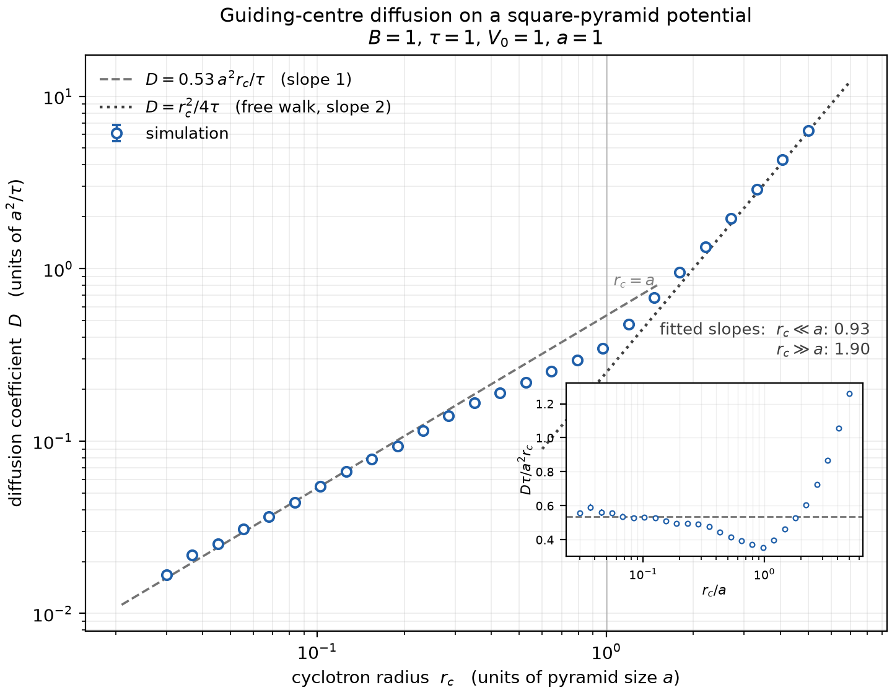
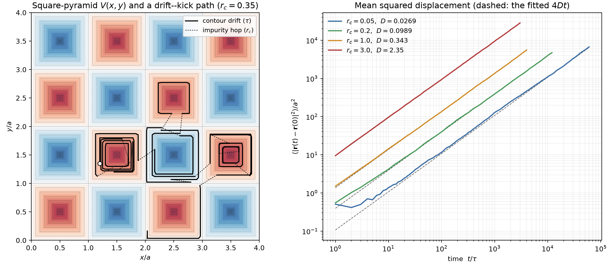

# Guiding-centre diffusion on a disordered / periodic potential

Simulation of electron diffusion in a 2-D potential landscape `V(x, y)` with a
perpendicular magnetic field `B = B ẑ`, in the regime where transport is a
sequence of **equipotential drifts interrupted by impurity scattering**.

## The model

In a strong field the cyclotron motion is fast and the guiding centre drifts with

```
v_d = (E × B)/B²  =  (ẑ × ∇V)/B ,        E = -∇V
```

which is everywhere perpendicular to `∇V`: the guiding centre **follows an
equipotential contour of V**, at speed `|∇V|/B`. An impurity collision randomises
the momentum, which re-centres the cyclotron orbit somewhere on the circle of
radius `r_c` around the electron — so the guiding centre **hops by `r_c` in a
random direction** and then follows whatever contour it landed on.

One elementary step of the walk is therefore

1. drift along the contour through `r` for a time `τ` (the mean free time, set by
   the impurity density),
2. hop `r → r + r_c (cos θ, sin θ)` with `θ` uniform on `[0, 2π)`.

Iterating and fitting the mean squared displacement gives the diffusion
coefficient in 2-D,

```
D = lim_{t→∞} ⟨|r(t) − r(0)|²⟩ / 4t .
```

## The square-pyramid landscape

The plane is tiled by unit cells `[i, i+1] × [j, j+1]`, each carrying a pyramid
whose apex is at the cell centre and which falls linearly to zero on the cell
edges, with alternating sign — a "pointy" `sin(πx) sin(πy)`:

```
V(x, y) = V₀ (−1)^(i+j) [ 1 − 2 max(|x − cx|, |y − cy|) / a ]
```

Every equipotential is an axis-aligned **square**, `|∇V| = 2V₀/a` is uniform (so
is the drift speed), and the zero level is the whole grid of cell edges — the
percolating network that joins hills to valleys through the saddles at the cell
corners.

Because the contours are squares traversed at constant speed, the drift step is
solved **in closed form**: map the point to its arclength along the square,
advance by `speed × τ` modulo the perimeter `8ℓ`, map back. One step, no
integration error, and no trouble at the pyramid ridges where `∇V` jumps by 90°.
That is `SquarePyramid.propagate`. For landscapes without such a closed form
(e.g. a random/disordered `V`) the base class `Potential.propagate` provides a
generic RK4 integrator with a Newton projection back onto the starting contour
after every substep, which conserves `V` to round-off; `Sinusoid` exercises it.

## Layout

```
mrdiff/potentials.py   landscapes + contour propagators (exact and generic)
mrdiff/walk.py         drift–kick walk, MSD, extraction of D
scripts/run_pyramid.py     sweep r_c at fixed B, write data/*.npz
scripts/plot_D_vs_rc.py    log-log plot of D(r_c)
scripts/plot_illustration.py  landscape + sample path + MSD curves
tests/test_physics.py  contour conservation, exact-vs-RK4, free-walk limit
```

## Running it

```
pip install numpy matplotlib
python scripts/run_pyramid.py            # ~5 min: the r_c sweep at B = 1, τ = 1
python scripts/plot_D_vs_rc.py           # figures/D_vs_rc_pyramid.png
python scripts/plot_illustration.py      # figures/pyramid_illustration.png
python -m pytest tests -q
```

Units: `a = V₀ = B = τ = 1`, so lengths are in units of the pyramid size `a`,
`D` in units of `a²/τ`, and the drift speed is `2V₀/(aB) = 2`.

## Modelling choices worth knowing about

* **The hop.** As specified, a collision moves the guiding centre by exactly
  `r_c` in a uniformly random direction. A more literal treatment would note
  that the electron sits on its cyclotron circle, so the guiding centre moves
  from `R` to `r_e + r_c u`, i.e. by `r_c (u - u')` with two independent random
  unit vectors — same physics, `⟨|Δ|²⟩ = 2 r_c²` instead of `r_c²`, an O(1)
  rescaling of `r_c`.
* **Bare vs orbit-averaged contours.** The guiding centre really follows
  contours of `V` averaged over the cyclotron orbit, i.e. of `V` smoothed on the
  scale `r_c`. That is a good approximation to the bare contours only for
  `r_c ≪ a`. For `r_c ≳ a` the smoothing would wash the landscape out; here the
  hops dominate anyway, so this affects the crossover region but not the
  large-`r_c` asymptote.
* **`r_c` and `B` are varied independently.** Physically `r_c = m v_F / eB`, and
  the drift speed `|∇V|/B` also carries a `1/B`. The sweep below fixes `B = 1`
  and `τ` and varies `r_c` alone, which isolates the *geometric* role of the
  hop length; it is not the same as a magnetic-field sweep.
* **τ vs the orbital period.** With `a = V₀ = B = τ = 1` the drift speed is 2, so
  a walker covers an arclength of 2 per step against a contour perimeter of at
  most 4. Contours are therefore substantially, but not completely, traversed
  between collisions.

## Results





`D(r_c)` at fixed `B = 1`, `τ = 1` has **two clean power-law regimes with an
exponent that is not the naive one**:

| regime | measured | law |
|---|---|---|
| `r_c ≪ a` | local slope ≈ 0.95 | `D ≈ 0.53 a² r_c / τ`  — **linear** in `r_c` |
| `r_c ≫ a` | local slope ≈ 1.9 → 2 | `D → r_c²/4τ`, the free random walk (ratio 1.01 at `r_c = 5a`) |

The large-`r_c` end is the trivial one: the hops dwarf the landscape, the walk is
just `n` random steps of length `r_c`, and `D = r_c²/4τ`.

The small-`r_c` end is the interesting one. Naively a walker that hops by `r_c`
should give `D ~ r_c²/τ`; instead it is **larger by a factor ~ a/r_c** (a factor
of 74 at `r_c = 0.03a`), and linear in `r_c`. The reason is that the hop is not
the transport step — the contour drift is:

* A kick changes the contour *level* by `δV = ∇V·δr`, i.e. `⟨δV²⟩ = 2V₀²r_c²/a²`.
  So `V` performs its own random walk with step `~ V₀ r_c/a`, and it takes
  `~(a/r_c)²` kicks to wander across the full range of `V`.
* While `|V|` stays finite the contour is a closed square inside one cell: the
  drift is fast but goes nowhere. Only near `V = 0`, on the percolating network
  of cell edges, can the walker cross into the next cell — and when it does,
  the drift carries it a **full cell**, `O(a)`, not `O(r_c)`.
* The walker sits within `δV ~ V₀ r_c/a` of the percolating level for a fraction
  `~ r_c/a` of its steps, so cell-to-cell moves happen at rate `~ r_c/(aτ)`,
  each of size `~a`:  `D ~ a² (r_c/a)/τ ∝ r_c`, with the measured coefficient
  0.53.

In between (`0.4 ≲ r_c/a ≲ 1.2`) the local slope *dips* to ≈ 0.7 before turning
up to 2 — the inset of the first figure shows this as a minimum of
`Dτ/a²r_c` near `r_c ≈ a`. Once a kick is as large as a cell, extra kick length
no longer buys extra cell crossings (you cannot cross more than about one cell
per kick), so the linear mechanism saturates before the `r_c²` free-walk term
takes over.

The MSD panel of the second figure shows why the runs have to be long at small
`r_c`: the sub-diffusive transient lasts the `~(a/r_c)²` kicks it takes to
randomise the contour level, and only then does `⟨Δr²⟩` become `4Dt`. Run
lengths are scaled as `200 (a/r_c)²` steps for this reason, and every point in
the sweep is checked to have `d ln MSD / d ln t = 1.00 ± 0.02` in its fit
window.
