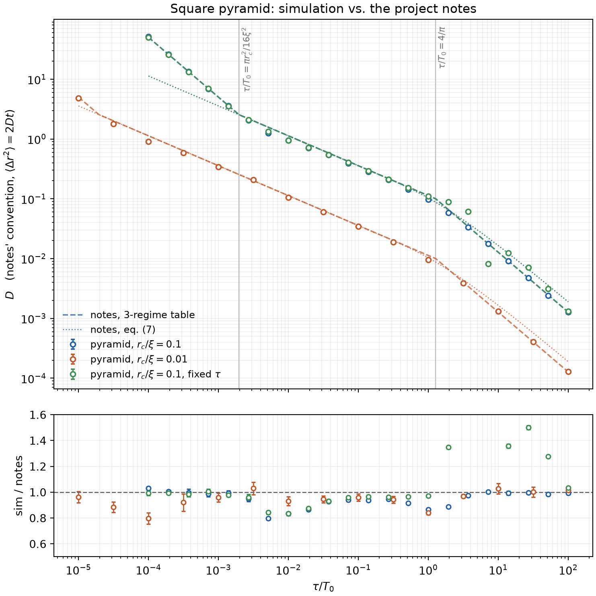
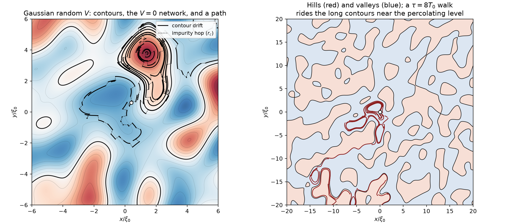
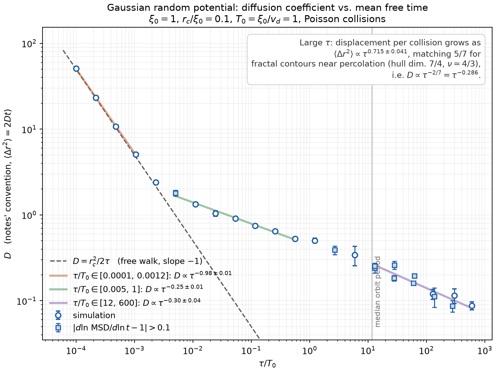
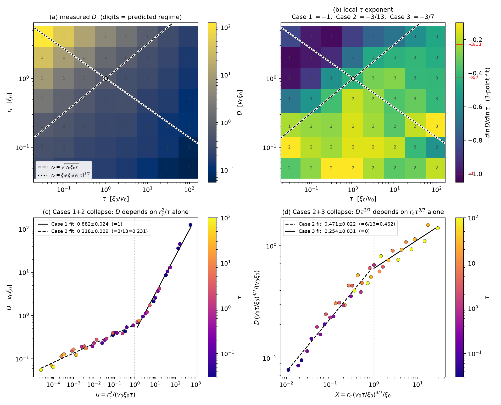
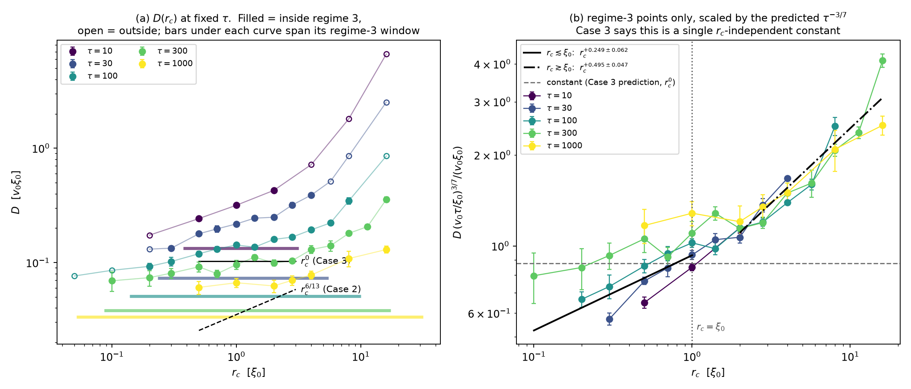
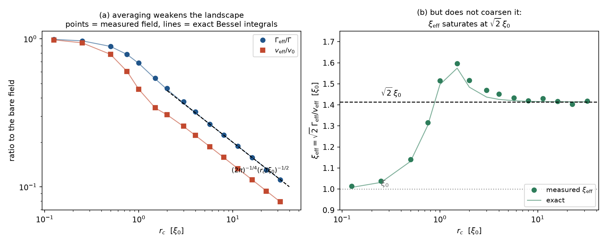
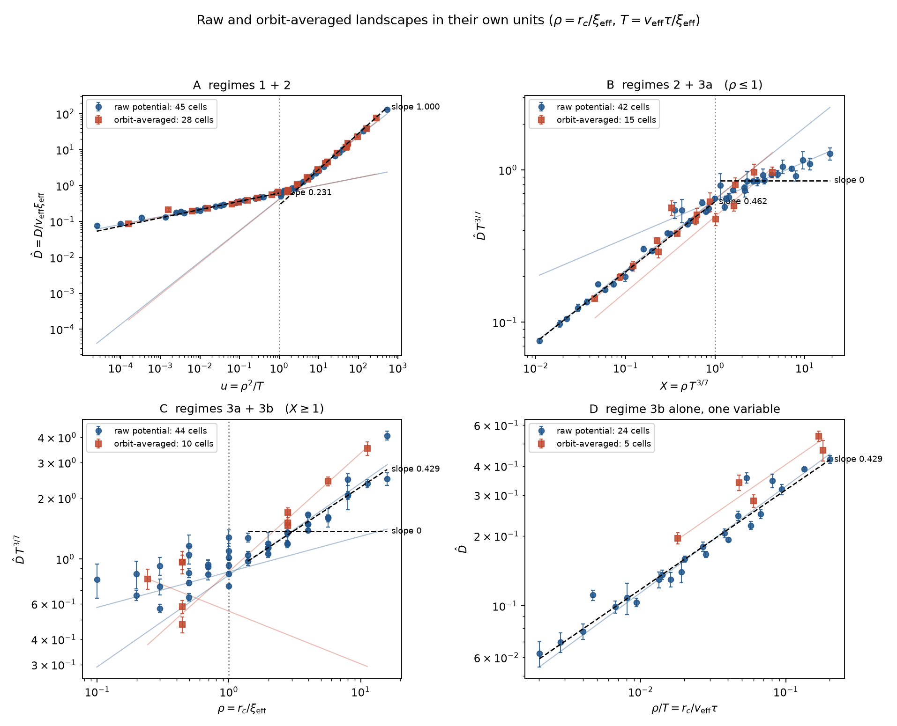
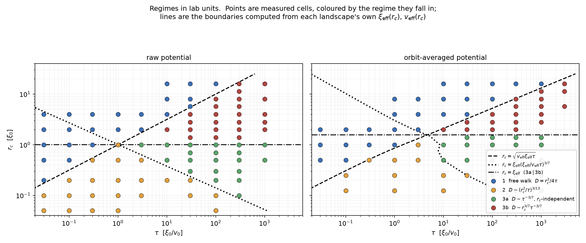
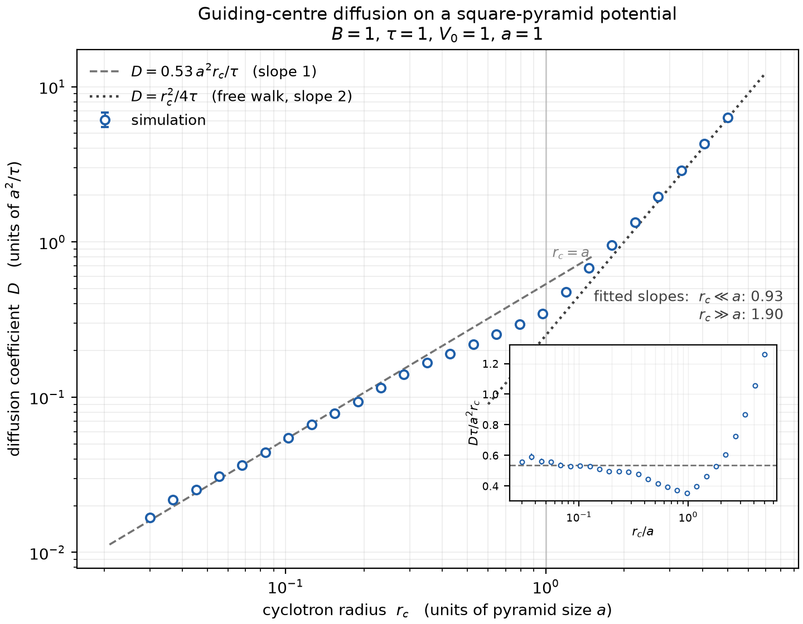
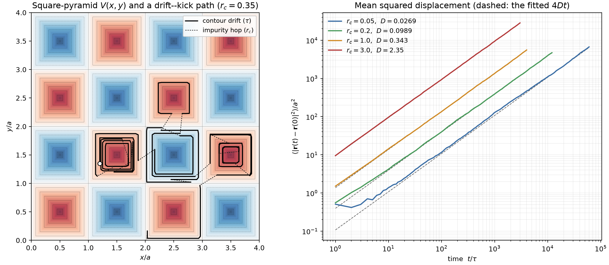

# Guiding-centre diffusion on a disordered / periodic potential

Simulation of electron diffusion in a 2-D potential landscape `V(x, y)` with a
perpendicular magnetic field `B = B ẑ`, in the regime where transport is a
sequence of **equipotential drifts interrupted by impurity scattering**.

## The model

In a strong field the cyclotron motion is fast and the guiding centre drifts with

```
v_d = (E × B)/B²  =  (ẑ × ∇V)/B ,        E = -∇V
```

which is everywhere perpendicular to `∇V`: the guiding centre **follows an
equipotential contour of V**, at speed `|∇V|/B`. An impurity collision randomises
the momentum, which re-centres the cyclotron orbit somewhere on the circle of
radius `r_c` around the electron — so the guiding centre **hops by `r_c` in a
random direction** and then follows whatever contour it landed on.

One elementary step of the walk is therefore

1. drift along the contour through `r` for a time `τ` (the mean free time, set by
   the impurity density),
2. hop `r → r + r_c (cos θ, sin θ)` with `θ` uniform on `[0, 2π)`.

Iterating and fitting the mean squared displacement gives the diffusion
coefficient in 2-D,

```
D = lim_{t→∞} ⟨|r(t) − r(0)|²⟩ / 4t .
```

## The square-pyramid landscape

The plane is tiled by unit cells `[i, i+1] × [j, j+1]`, each carrying a pyramid
whose apex is at the cell centre and which falls linearly to zero on the cell
edges, with alternating sign — a "pointy" `sin(πx) sin(πy)`:

```
V(x, y) = V₀ (−1)^(i+j) [ 1 − 2 max(|x − cx|, |y − cy|) / a ]
```

Every equipotential is an axis-aligned **square**, `|∇V| = 2V₀/a` is uniform (so
is the drift speed), and the zero level is the whole grid of cell edges — the
percolating network that joins hills to valleys through the saddles at the cell
corners.

Because the contours are squares traversed at constant speed, the drift step is
solved **in closed form**: map the point to its arclength along the square,
advance by `speed × τ` modulo the perimeter `8ℓ`, map back. One step, no
integration error, and no trouble at the pyramid ridges where `∇V` jumps by 90°.
That is `SquarePyramid.propagate`. For landscapes without such a closed form
(e.g. a random/disordered `V`) the base class `Potential.propagate` provides a
generic RK4 integrator with a Newton projection back onto the starting contour
after every substep, which conserves `V` to round-off; `Sinusoid` exercises it.

## Layout

```
mrdiff/potentials.py   landscapes + contour propagators (exact and generic)
mrdiff/theory.py       the project notes' analytic regimes, and conventions
mrdiff/walk.py         drift–kick walk, MSD, extraction of D
scripts/run_pyramid.py     sweep r_c at fixed B, write data/*.npz
scripts/plot_D_vs_rc.py    log-log plot of D(r_c)
scripts/plot_illustration.py  landscape + sample path + MSD curves
tests/test_physics.py  contour conservation, exact-vs-RK4, free-walk limit
```

## Running it

```
pip install numpy matplotlib
python scripts/run_pyramid.py            # ~5 min: the r_c sweep at B = 1, τ = 1
# optional ~11 min extension to r_c = 0.0125a (the runs get long as (a/r_c)^2)
python scripts/run_pyramid.py --rc-min 0.0125 --rc-max 0.0225 --n-rc 3 \
    --max-steps 1500000 --min-walkers 384 --seed 7000 \
    --out data/D_vs_rc_pyramid_small.npz
python scripts/plot_D_vs_rc.py           # figures/D_vs_rc_pyramid.png
python scripts/plot_illustration.py      # figures/pyramid_illustration.png

# D(tau): the notes' comparison, and the random potential
python scripts/run_tau_sweep.py --potential pyramid --rc 0.1 --collisions poisson
python scripts/run_tau_sweep.py --potential random --rc 0.1 --tau-min 0.3 \
    --tau-max 30 --n-tau 9 --n-real 5 --fixed-time 8000 --min-steps 200 \
    --min-walkers 800 --max-walkers 800
python scripts/plot_D_vs_tau.py --data data/D_vs_tau_*.npz --ratio --fit-power
python scripts/plot_random_illustration.py
python -m pytest tests -q
```

Units: `a = V₀ = B = τ = 1`, so lengths are in units of the pyramid size `a`,
`D` in units of `a²/τ`, and the drift speed is `2V₀/(aB) = 2`.

## Comparison with the project notes

`mrdiff/theory.py` encodes the analytic regimes of the notes (sections 1-5; the
Isichenko re-derivation of section 6 is deliberately left out). Two conventions
have to be lined up first:

* **Geometry.** In the notes `xi` is the pyramid *half*-width: cells are
  `2xi x 2xi`, adjacent apexes are `2xi` apart, `|grad V| = Gamma/xi`. In this
  code that is `SquarePyramid(V0=Gamma, a=2*xi)`.
* **Convention.** The notes define D through `<|dr|^2> = 2 D t`, i.e. their D is
  `Dxx + Dyy`. Everywhere else here D is the standard 2-D `<|dr|^2> = 4 D t`.
  So `D_notes = 2 D_here`.



**The three-regime table of the notes is confirmed.** Sweeping `tau` over six
decades at `r_c/xi = 0.1` and `0.01` (`xi = Gamma = B = 1`, so `v_d = 1` and
`T0 = xi/v_d = 1`), simulation/theory is:

| regime | notes | sim / notes |
|---|---|---|
| 1, `tau/T0 < pi r_c^2/16 xi^2` | `D = r_c^2/2 tau` | 0.99 - 1.03 |
| 2, up to `tau/T0 = 4/pi` | `D = 2 xi r_c/sqrt(pi T0 tau)` | 0.80 - 0.97 |
| 3, `tau/T0 > 4/pi` | `D = 4 xi r_c/(pi tau)` | 0.98 - 1.00 |

Regimes 1 and 3 come out to ~1%; the measured local log-log slopes are -1.0,
-1/2 and -1.0 as predicted, and the crossovers sit where the notes put them
(they move as `r_c^2`, which the two `r_c` curves confirm).

Two corrections to the notes came out of this:

1. **Collisions must be Poissonian.** The notes say the electron collides "on
   average after `tau`". Drifting for *exactly* `tau` is a different model: on a
   closed contour it is a rigid rotation repeated every step, which is not
   ergodic on the orbit, and it leaves visible commensurability artefacts once
   `tau > T0` (green points in the figure -- up to 1.5x off, and not monotonic).
   With exponential drift times of mean `tau`, regime 3 is reproduced to better
   than 1%. `simulate(..., collisions="poisson")` does this.
2. **Eq. (7) is wrong at large `tau`, and the `2/pi` in fig. 3 is exactly why.**
   Its own `tau >> T0` limit is `2 xi r_c/tau`, which is `pi/2` above regime 3.
   Multiplying by `2/pi` maps it onto `4 xi r_c/(pi tau)` -- and it is regime 3
   that the simulation agrees with, so the correction belongs to eq. (7), not to
   the regime-3 result. Eq. (7) is good to ~5% in the crossover region itself.

## The same analysis on a random potential

The random landscape is a sum of sine waves whose wavelength weights are
Gaussian:

```
V(r) = Gamma sqrt(2/N) sum_j cos(k_j . r + phi_j)
```

with uniformly random directions and phases and `|k|` drawn from
`p(k) = k xi0^2 exp(-k^2 xi0^2/2)`. That spectrum makes the correlation function
exactly Gaussian, `<V(0) V(r)> = Gamma^2 exp(-r^2/2 xi0^2)`, so the correlation
length **is** `xi0`, set to 1 (checked against the exact form). The field is
homogeneous, isotropic and *not* periodic, so there is no artificial lattice.
Contours are followed with the generic RK4 + projection propagator, and `Gamma`
is scaled so that `rms|grad V| = Gamma_pyr/xi`, i.e. both landscapes have the
same drift speed and the same `T0 = xi0/v_d = 1`.



The right panel is the essential difference from the pyramid: pyramid contours
are closed squares trapped inside one cell, but a random landscape has contours
of *every* size, diverging at the percolating level `V = 0`, and a walker that
lands near that level rides a single contour for tens of `xi0`.



Sweeping `tau/T0` over seven decades at `r_c/xi0 = 0.1` gives **three regimes**:

| regime | `tau/T0` | measured | |
|---|---|---|---|
| collision-limited | `1e-4 .. 1e-3` | `D ~ tau^(-0.981 +- 0.009)` | the free walk `D = r_c^2/2 tau`, to 2-7% |
| landscape-dominated | `5e-3 .. 1` | `D ~ tau^(-0.248 +- 0.013)` | |
| many loops per collision | `12 .. 600` | `D ~ tau^(-0.30 +- 0.04)` | |

1. **Short `tau` recovers the free walk.** With a collision every `1e-4 T0` the
   drift covers only `1e-4 xi0` between kicks and the landscape is irrelevant:
   `D/(r_c^2/4 tau) = 1.02` at the shortest time, rising to 1.1 by
   `tau/T0 = 2e-3` as the drift starts to help. By `tau/T0 = 300` the landscape
   has multiplied D by nearly **7000** over the free-walk value.

2. **The large-`tau` regime is a distinct power law, and it is the percolation
   one.** Once `tau` exceeds the typical orbital period (median ~12 `T0`, from
   `Potential.orbit_period`) a walker on a closed contour has gone all the way
   round, so its displacement stops growing -- but contours near the percolating
   level are unbounded and fractal, and those are the ones that keep
   transporting. Measuring the displacement per collision directly:

   ```
   <|dr|^2> per collision  ~  tau^(0.715 +- 0.041)      (tau/T0 >= 12)
   ```

   In time `tau` a walker covers arclength `v tau`, which on a hull of fractal
   dimension 7/4 spans a region of size `(v tau)^(4/7)`; the level window whose
   contours are that large is `|V| < (v tau)^(-3/7)` with `xi(V) ~ |V|^(-4/3)`.
   Averaging `min(contour size, (v tau)^(4/7))^2` over the level distribution
   gives `<|dr|^2> ~ (v tau)^(5/7)`, i.e. **`5/7 = 0.714`** against the measured
   `0.715 +- 0.041`, and therefore

   ```
   D ~ tau^(5/7 - 1) = tau^(-2/7) = tau^(-0.286)
   ```

   against the measured `-0.30 +- 0.04`. The intermediate `-0.25` regime is the
   crossover between the free walk and this asymptote, not a law of its own.

**Efficiency: loop detection.** Reaching `tau/T0 = 600` by brute-force
integration would mean 4800 RK4 steps for every single drift. Instead
`Potential.orbit_period` times the closed orbit -- integrating until the walker
has left a neighbourhood of its start and come back, with both radii scaled by
the arclength covered in one step so the test works for a tiny orbit round an
extremum and a huge one near percolation alike, then refining the crossing time
by projecting the residual offset onto the drift velocity -- and
`propagate(loop_detect=True)` replaces `tau` by `tau mod P`. A drift then costs
about `2P` of integration instead of `tau`. It was checked against the exact
pyramid map (periods to 0.1%), against the sinusoid (propagating by the detected
period returns to the start to 3e-4) and against brute force on the random field
itself; it is 14x faster at `tau = 1000` and the gap grows linearly. A walker
whose orbit does not close within `tau` has by then been integrated for exactly
`tau`, so it keeps that end point rather than paying twice.

Two numerical points that mattered:

Two numerical points that mattered:

* **Observation time.** The random landscape keeps a sub-diffusive tail far
  longer than the pyramid (`d ln MSD/d ln t` is still 0.94 after ~10^4 collision
  times, where the pyramid is at 1.00 immediately), so a D measured over a
  short window is not the same as one measured over a long window. The sweep was
  therefore repeated with `--fixed-time`, every `tau` run for the *same* total
  time so that D comes from one common lag window. The two protocols agree to
  within 5% at every matched `tau`, so the exponent is not an artefact of it.
* **Fixed step size, not a fixed step count.** With exponential drift times, a
  walker that draws `dt = 5 tau` must not be integrated with a step five times
  coarser than the scheme was validated at, so the integrator takes a fixed `h`
  and a per-walker number of steps.
* **RK4 step size.** The projection cannot hold a walker on its contour once the
  time step exceeds ~`0.25 xi0/v_rms`: at `h = 1` the level drifts by up to 0.19
  and D is inflated 2x. At `h = 0.25` and `h = 0.125`, V is conserved to 5e-7 and
  5e-13 and D agrees within errors, so the sweeps use `h = 0.125`.
  `n_modes` (32/64/128) and disorder realisation both shift D by less than the
  +-20% realisation scatter, which is why each point averages 5 independent
  fields.

The percolation scaling quoted above uses only the standard 2-D exponents (hull
dimension 7/4, `nu = 4/3`); the notes' own section-6 derivation is still excluded
from `mrdiff/theory.py` on the grounds that its argument is unsound.

## Mapping the regimes: a sweep over the (r_c, tau) plane

`scripts/run_grid.py` measures `D` on a grid of `(r_c, tau)`, one cell at a
time, saving after every cell so a run can be interrupted and resumed. The map
below merges five such runs on one fixed landscape (`L = 400 xi_0`, `xi_0 = 1`,
`Gamma = 1/sqrt(2)` so `v_0 = 1`), 75 usable cells covering

```
r_c  = 0.05 ... 16 xi_0        (2.5 decades)
tau  = 0.03 ... 1000 xi_0/v_0  (4.5 decades)
```

with 192 walkers per cell (768 for the interior), Poissonian collisions and
loop detection. Six cells are dropped because their MSD is still sub-diffusive
in the fit window (`|d ln MSD/d ln t - 1| > 0.15`), all of them in the
small-`r_c`, large-`tau` corner where randomising the contour level takes many
kicks.

    python scripts/run_grid.py --out data/grid_D.npz
    python scripts/plot_phase_diagram.py --data data/grid_*.npz

### The boundaries come out of the data without fitting

Setting the three predicted laws equal pairwise gives, with `xi_0 = v_0 = 1`,

| boundary | locus | |
|---|---|---|
| Case 1 / Case 2 | `r_c = sqrt(v_0 xi_0 tau)` | `u = r_c^2/(v_0 xi_0 tau) = 1` |
| Case 2 / Case 3 | `r_c = xi_0 (xi_0/v_0 tau)^(3/7)` | `X = r_c (v_0 tau/xi_0)^(3/7)/xi_0 = 1` |

which cross at the triple point `(tau, r_c) = (1, 1)`. Both are visible
directly as kinks in a one-variable collapse:

* Cases 1 and 2 both make `D` a function of `u = r_c^2/(v_0 xi_0 tau)` alone.
  Every non-Case-3 cell collapses onto one curve over four decades in `u`, with
  a sharp break at `u = 1`.
* Cases 2 and 3 both make `D (v_0 tau/xi_0)^(3/7)` a function of
  `X = r_c (v_0 tau/xi_0)^(3/7)` alone. Every non-Case-1 cell collapses over
  four decades in `X`, with a break at `X = 1`.

Nothing in either collapse is fitted: the scaling variables and the location of
the kinks are the prediction.

### Exponents

Joint fits of `ln D = a ln(tau) + b ln(r_c) + const` over the cells that stay at
least a factor `e` away from both boundaries of their regime:

| regime | `a` measured | predicted | `b` measured | predicted |
|---|---|---|---|---|
| Case 1 | `-0.964 +- 0.009` | `-1` | `+1.958 +- 0.023` | `+2` |
| Case 2 | `-0.185 +- 0.008` | `-3/13 = -0.231` | `+0.382 +- 0.028` | `+6/13 = +0.462` |
| Case 3 | `-0.350 +- 0.016` | `-3/7 = -0.429` | `+0.219 +- 0.022` | `0` |

Case 1 is exact to a couple of percent. Case 2 is 20% shallow in both exponents
but with the ratio `b/a = -2.06` pinned to `-2`, which is the real content of
the regime: `D` depends on `r_c` and `tau` only through `r_c^2/tau`. The
collapse fit, which uses all 42 non-Case-3 cells rather than the deep-interior
subset, gives `0.206 +- 0.006` against `3/13 = 0.231`, and a dedicated `tau`
sweep at fixed `r_c = 0.1` gave `-0.232 +- 0.009` over 2.7 decades — so `-3/13`
is right and the deep-interior subset here is biased by sitting at small `tau`,
where `v_0 tau` is not yet large compared with `xi_0`.

### Case 3 is approached, not reached

Case 3 is the only place where the map disagrees with the prediction at the
level of an exponent, and both of its exponents drift toward the predicted
values as the cells move deeper into the regime:

| cells kept | `d ln D/d ln tau` | `d ln D/d ln r_c` |
|---|---|---|
| margin `> e^0.0` | `-0.351 +- 0.022` | `+0.285 +- 0.028` |
| margin `> e^0.7` | `-0.350 +- 0.016` | `+0.219 +- 0.022` |
| margin `> e^1.2` | `-0.353 +- 0.026` | `+0.201 +- 0.035` |
| margin `> e^1.8` | `-0.341 +- 0.039` | `+0.100 +- 0.066` |
| margin `> e^0.7`, `tau >= 300` | `-0.410 +- 0.066` | `+0.223 +- 0.034` |

The `r_c` exponent falls monotonically toward `0` as the margin grows, and is
consistent with `0` at the deepest cut. The `tau` exponent moves toward `-3/7`
only when the small-`tau` cells are dropped; row by row at fixed `r_c` it
steepens with `r_c` as well — `-0.326 +- 0.057` at `r_c = 0.5`, `-0.342 +-
0.028` at `r_c = 1`, `-0.420 +- 0.025` at `r_c = 2` — matching the
`-0.427 +- 0.021` found earlier from a dedicated sweep at `r_c = 2` over
`tau = 100 ... 1000`.

This is the same finite-size effect already measured directly on the contour
statistics: `-3/7` follows from `(2 - a)/d_h - 1` with the tail exponent
`a = 1` and `d_h = 7/4`, and the *measured* `a` only creeps up to `0.93` on the
largest box, while grid-labelled contours give `d_h = 1.633 +- 0.009` rather
than `1.75`. Putting the measured values in gives `-0.39`, between the observed
`-0.35` and the asymptotic `-0.43`. The regime is real and its trend is right;
the accessible `tau` is not large enough to sit on the asymptote.



### `D` as a function of `r_c` inside regime 3

`scripts/plot_D_vs_rc_case3.py` cuts the map the other way: `D(r_c)` at fixed
`tau`, keeping only the points inside that `tau`'s regime-3 window
`tau^(-3/7) < r_c < sqrt(tau)`. The window opens at the triple point and widens
as `tau^(13/14)`, so large `tau` gives the long lever arm — at `tau = 1000` it
spans `0.05 ... 32 xi_0`. 43 points survive, from `tau = 10` to `1000`.

    python scripts/plot_D_vs_rc_case3.py --data data/grid*.npz

Dividing out the predicted `tau^(-3/7)` collapses all five `tau` curves onto one
another, so the `tau` scaling is doing its job. But the collapsed curve is not
the flat line Case 3 predicts. It **breaks at `r_c ~ xi_0`**, which is neither
of the two predicted boundaries:

| branch | n | `d ln D/d ln r_c` | `<D tau^(3/7)>` |
|---|---|---|---|
| `r_c <= xi_0` | 19 | `+0.249 +- 0.062` | 0.875 |
| `r_c >= 2 xi_0` | 21 | `+0.495 +- 0.047` | 1.594 |

Below `xi_0` the exponent is still drifting to zero with `tau` — `+0.377 +-
0.063` at `tau = 30`, `+0.269 +- 0.038` at `tau = 100`, `+0.112 +- 0.069` at
`tau = 300` — i.e. consistent with the predicted `r_c^0` by `tau = 300`. Above
`xi_0` it is not converging on anything near zero: it sits at `r_c^(1/2)`, ten
standard deviations from flat, and the same split shows up as the margin cut in
the phase-diagram fit (`+0.372` over the whole regime, `+0.169 +- 0.060` once
only deep-interior cells are kept, since the deep interior is mostly `r_c` of
order `xi_0`).

The break is where the un-averaged model is expected to fail. Every run here
uses the bare landscape — `run_grid.py` builds `PeriodicGaussianField` without
`ring_average`, so the same `V` is used at `r_c = 0.05` and at `r_c = 16`. A
drift-and-kick walk on a bare landscape has nothing that makes a kick longer
than the correlation length irrelevant: once `r_c >> xi_0` every kick lands on a
fully uncorrelated contour, so transport keeps growing with `r_c`. Orbit
averaging is exactly the missing ingredient — it renormalises the landscape's
correlation length towards `r_c` and shrinks the amplitude as
`Gamma_eff = sqrt(exp(-r_c^2) I_0(r_c^2))`. So Case 3's `r_c`-independence
should be read as a statement about the `r_c <~ xi_0` part of its window, and
the `r_c >~ xi_0` branch measures the cost of ignoring the averaging.



## All regimes, raw and orbit-averaged

The two landscapes are compared by reducing every cell to the landscape's *own*
units.  With `Gamma_eff`, `v_eff = rms|grad V'|` and
`xi_eff = sqrt(2) Gamma_eff / v_eff` measured from the field itself,

    rho = r_c / xi_eff      T = v_eff tau / xi_eff      Dhat = D / (v_eff xi_eff)

    python scripts/measure_avg_landscape.py     # what averaging does to the field
    python scripts/run_grid.py --orbit-average  # ... --rc ... --tau ...
    python scripts/analyse_regimes.py           # the four collapses + all fits
    python scripts/plot_phase_both.py           # both phase diagrams, lab units

89 raw cells (`rho` 0.05...16, `T` 0.03...990) and 75 averaged cells
(`rho` 0.12...11, `T` 0.006...980).

### What orbit averaging actually does

`V'` has every Fourier mode of `V` scaled by `J_0(|k| r_c)`, so for
`<V(0)V(r)> = Gamma^2 exp(-r^2/2 xi0^2)` the averaged field is still Gaussian
with spectrum `S(k) J_0(k r_c)^2`.  Measured against the real periodic field, the
exact Bessel integrals hold to better than 1% over `r_c = 0.125 ... 32 xi_0`:

| | small `r_c` | large `r_c` |
|---|---|---|
| `Gamma_eff/Gamma` | `sqrt(exp(-x) I_0(x))`, `x=(r_c/xi_0)^2` | `(2 pi)^(-1/4) (xi_0/r_c)^(1/2)` |
| `v_eff/v_0` | -- | `(2 pi)^(-1/4) 2^(-1/2) (xi_0/r_c)^(1/2)` |
| `xi_eff` | `xi_0` | **`sqrt(2) xi_0`** (measured 1.4173 at `r_c=16`) |

So averaging **weakens** the landscape (`v_eff ~ r_c^(-1/2)`) but does **not**
coarsen it: `xi_eff` overshoots to 1.6 near `r_c ~ 1.5 xi_0` and then saturates
at `sqrt(2) xi_0`.  Everything else follows from that one fact.



### Four regimes, not three

The `(r_c, tau)` plane needs four regions.  Three are the notes'; the fourth,
3b, is what happens once the kick is longer than the correlation length.

| regime | window | law | how it is a single curve |
|---|---|---|---|
| 1 free walk | `rho > sqrt(T)` | `D = r_c^2/4tau` | `Dhat = u/4`, `u = rho^2/T` |
| 2 Levy contours | `X < 1` | `Dhat ~ (rho^2/T)^(3/13)` | `Dhat = f(u)` |
| 3a contour-limited | `X > 1`, `rho < 1` | `Dhat ~ T^(-3/7)` | `Dhat T^(3/7) = const` |
| 3b contour-limited | `X > 1`, `rho > 1` | `Dhat ~ (rho/T)^(3/7)` | `Dhat = g(r_c/v_eff tau)` |

with `X = rho T^(3/7)`.  Three collapses cover the plane: **A** `Dhat` vs `u`
(regimes 1+2, kink at `u=1`), **B** `Dhat T^(3/7)` vs `X` (regimes 2+3a, kink at
`X=1`), **C** `Dhat T^(3/7)` vs `rho` (regimes 3a+3b, kink at `rho=1`).  A
fourth, **D**, puts regime 3b on its single variable `rho/T = r_c/v_eff tau`.

**Regime 3b** is not in the notes.  Fixing the `tau` exponent at `-3/7`, the
preferred `r_c` exponent is also `3/7`, and the one-parameter fit gives

    D = 0.82 v_0 xi_0 (r_c / v_0 tau)^(3/7)      p = 0.408 +- 0.017  vs  3/7 = 0.4286

with a 5.4% residual over 16 raw cells spanning `rho = 2...16`, `T = 30...1000`.
That is regime 3 with the tube width taken at coarse-graining scale `r_c`
instead of `xi_0`: `w = xi (L/xi)^(-3/7)` becomes `xi (L/r_c)^(-3/7)`, because a
walker kicked by `r_c` cannot resolve contour structure below `r_c`.  The two
branches join smoothly at `rho = 1` (amplitudes 0.82 and 0.90).

### Exponents in the landscape's own units

`Dhat ~ T^a rho^b`, cells at least a factor `e^0.5` from every regime line:

| regime | raw `a` | averaged `a` | predicted | raw `b` | averaged `b` | predicted |
|---|---|---|---|---|---|---|
| 1  | `-0.926 +- 0.016` | `-0.930 +- 0.013` | `-1` | `+1.847 +- 0.032` | `+1.875 +- 0.027` | `+2` |
| 2  | `-0.207 +- 0.006` | `-0.170 +- 0.031` | `-3/13` | `+0.400 +- 0.016` | `+0.362 +- 0.063` | `+6/13` |
| 3a | `-0.305 +- 0.015` | `-0.353 +- 0.068` | `-3/7` | `+0.242 +- 0.070` | `-0.023 +- 0.176` | `0` |
| 3b | `-0.411 +- 0.017` | `-0.370 +- 0.030` | `-3/7` | `+0.376 +- 0.031` | `+0.412 +- 0.058` | `+3/7` |

Regime 1 is exact once boundary cells are dropped: at margin `e^1.5` the raw fit
is `T^(-0.983 +- 0.009) rho^(+1.999 +- 0.021)`.

**The two models agree regime by regime**, which is the central result — the
averaged case is the raw case with `(xi_0, v_0) -> (xi_eff, v_eff)`, nothing
more.  On the collapses themselves:

| branch | raw | averaged | predicted |
|---|---|---|---|
| A, regime 2 | `+0.217 +- 0.005` | `+0.223 +- 0.013` | `+0.231` |
| B, regime 2 | `+0.469 +- 0.010` | `+0.476 +- 0.022` | `+0.462` |
| B, regime 3a | `+0.251 +- 0.021` | `+0.268 +- 0.043` | `0` |
| C, regime 3a | `+0.176 +- 0.071` | `+0.000 +- 0.126` | `0` |
| D, regime 3b `p` | `+0.408 +- 0.017` | `+0.365 +- 0.029` | `+0.429` |
| 3a amplitude | `0.904 +- 0.059` | `0.976 +- 0.060` | -- |

The averaged data reaches `T ~ 10^3` at small `rho`, so it settles regime 3a's
`r_c`-independence that the raw grid could only approach: `b = -0.023 +- 0.176`
and a flat branch C, `+0.000 +- 0.126`.  The only real difference is regime 3b's
amplitude, `C = 0.82` raw against `1.03` averaged -- a non-universal prefactor,
expected because `S(k) J_0(k r_c)^2` is a different spectral shape from a
Gaussian even at equal `xi_eff`.



### The same regimes in lab units

Substituting `v_eff ~ (2 pi)^(-1/4) 2^(-1/2) v_0 (xi_0/r_c)^(1/2)` and
`xi_eff = sqrt(2) xi_0` (valid for `r_c >~ 2 xi_0`) turns the table above into
laws for `D(r_c, tau)` that look nothing alike:

| regime | raw | orbit-averaged |
|---|---|---|
| 1  | `D = r_c^2/4tau` | `D = r_c^2/4tau`  (landscape-free, identical) |
| 2  | `D ~ tau^(-3/13) r_c^(+6/13)` | `D ~ tau^(-3/13) r_c^(+1/13)` |
| 3a | `D ~ tau^(-3/7) r_c^0` | `D ~ tau^(-3/7) r_c^(-2/7)` |
| 3b | `D ~ tau^(-3/7) r_c^(+3/7)` | `D ~ tau^(-3/7) r_c^(+1/7)` |

and measured directly in lab units:

| regime | raw | averaged |
|---|---|---|
| 1  | `tau^(-0.926+-0.016) r_c^(+1.847+-0.032)` | `tau^(-0.930+-0.013) r_c^(+1.838+-0.033)` |
| 3a | `tau^(-0.305+-0.015) r_c^(+0.242+-0.070)` | `tau^(-0.352+-0.068) r_c^(-0.007+-0.158)` |
| 3b | `tau^(-0.411+-0.017) r_c^(+0.376+-0.031)` | `tau^(-0.393+-0.020) r_c^(+0.180+-0.052)` |

The last row is the headline: **averaging suppresses the raw model's spurious
`r_c` growth in regime 3b from `r_c^(3/7) = r_c^0.429` to `r_c^(1/7) = r_c^0.143`**,
measured `+0.376 +- 0.031` against `+0.180 +- 0.052` (a 3.3 sigma difference,
each matching its own prediction).  Averaging very nearly restores the
`r_c`-independence the notes predict, without ever being put in by hand.

Two caveats on that table.  Averaged regime 3a lives at `r_c < xi_eff = 1.41
xi_0`, where `v_eff` has not yet reached its `r_c^(-1/2)` asymptote, so its lab
`r_c` exponent is `~0` (measured `-0.007 +- 0.158`) rather than `-2/7`; the two
differ by only 1.8 sigma and the grid cannot separate them.  Averaged regime 2
is likewise confined to `r_c <= xi_0`, so it has no clean lab power law either.

### The boundaries move

Each boundary is the same condition in landscape units, but `xi_eff(r_c)` and
`v_eff(r_c)` bend the lines in lab units:

| boundary | raw | orbit-averaged (large `r_c`) |
|---|---|---|
| 1 / 2 | `r_c = sqrt(v_0 xi_0 tau) ~ tau^(1/2)` | `r_c ~ tau^(2/5)` |
| 2 / 3 | `r_c = xi_0 (xi_0/v_0 tau)^(3/7) ~ tau^(-3/7)` | `r_c ~ tau^(-6/11)` |
| 3a / 3b | `r_c = xi_0` | `r_c = sqrt(2) xi_0` |

so averaging pushes the triple point from `(tau, r_c) = (1, 1)` out to roughly
`(5, 1.5)` and shrinks the drift-dominated wedge at large `r_c` -- a weaker
landscape is beaten by the kicks sooner.



## Modelling choices worth knowing about

* **The hop.** As specified, a collision moves the guiding centre by exactly
  `r_c` in a uniformly random direction. A more literal treatment would note
  that the electron sits on its cyclotron circle, so the guiding centre moves
  from `R` to `r_e + r_c u`, i.e. by `r_c (u - u')` with two independent random
  unit vectors — same physics, `⟨|Δ|²⟩ = 2 r_c²` instead of `r_c²`, an O(1)
  rescaling of `r_c`.
* **Bare vs orbit-averaged contours.** The guiding centre really follows
  contours of `V` averaged over the cyclotron orbit, i.e. of `V` smoothed on the
  scale `r_c`. That is a good approximation to the bare contours only for
  `r_c ≪ a`. For `r_c ≳ a` the smoothing would wash the landscape out; here the
  hops dominate anyway, so this affects the crossover region but not the
  large-`r_c` asymptote.
* **`r_c` and `B` are varied independently.** Physically `r_c = m v_F / eB`, and
  the drift speed `|∇V|/B` also carries a `1/B`. The sweep below fixes `B = 1`
  and `τ` and varies `r_c` alone, which isolates the *geometric* role of the
  hop length; it is not the same as a magnetic-field sweep.
* **τ vs the orbital period.** With `a = V₀ = B = τ = 1` the drift speed is 2, so
  a walker covers an arclength of 2 per step against a contour perimeter of at
  most 4. Contours are therefore substantially, but not completely, traversed
  between collisions.

## Results





`D(r_c)` at fixed `B = 1`, `τ = 1` has **two clean power-law regimes with an
exponent that is not the naive one**:

| regime | measured | law |
|---|---|---|
| `r_c ≪ a` | slope 0.96 over the decade below `0.1a` | `D ≈ 0.55 a² r_c / τ`  — **linear** in `r_c` |
| `r_c ≫ a` | slope 1.90 → 2 | `D → r_c²/4τ`, the free random walk (ratio 1.01 at `r_c = 5a`) |

The sweep covers `r_c = 0.0125a … 5a`, i.e. 2.6 decades.

The large-`r_c` end is the trivial one: the hops dwarf the landscape, the walk is
just `n` random steps of length `r_c`, and `D = r_c²/4τ`.

The small-`r_c` end is the interesting one. Naively a walker that hops by `r_c`
should give `D ~ r_c²/τ`; instead it is **larger by a factor ~ a/r_c** (190x at
`r_c = 0.0125a`), and linear in `r_c`. The reason is that the hop is not
the transport step — the contour drift is:

* A kick changes the contour *level* by `δV = ∇V·δr`, i.e. `⟨δV²⟩ = 2V₀²r_c²/a²`.
  So `V` performs its own random walk with step `~ V₀ r_c/a`, and it takes
  `~(a/r_c)²` kicks to wander across the full range of `V`.
* While `|V|` stays finite the contour is a closed square inside one cell: the
  drift is fast but goes nowhere. Only near `V = 0`, on the percolating network
  of cell edges, can the walker cross into the next cell — and when it does,
  the drift carries it a **full cell**, `O(a)`, not `O(r_c)`.
* The walker sits within `δV ~ V₀ r_c/a` of the percolating level for a fraction
  `~ r_c/a` of its steps, so cell-to-cell moves happen at rate `~ r_c/(aτ)`,
  each of size `~a`:  `D ~ a² (r_c/a)/τ ∝ r_c`, with the measured coefficient
  0.55 (flat to ±6% over the whole decade `0.0125 ≤ r_c/a ≤ 0.13`).

In between (`0.4 ≲ r_c/a ≲ 1.2`) the local slope *dips* to ≈ 0.7 before turning
up to 2 — the inset of the first figure shows this as a minimum of
`Dτ/a²r_c` near `r_c ≈ a`. Once a kick is as large as a cell, extra kick length
no longer buys extra cell crossings (you cannot cross more than about one cell
per kick), so the linear mechanism saturates before the `r_c²` free-walk term
takes over.

The MSD panel of the second figure shows why the runs have to be long at small
`r_c`: the sub-diffusive transient lasts the `~(a/r_c)²` kicks it takes to
randomise the contour level, and only then does `⟨Δr²⟩` become `4Dt`. Run
lengths are scaled as `200 (a/r_c)²` steps for this reason, and every point in
the sweep is checked to have `d ln MSD / d ln t = 1.00 ± 0.02` in its fit
window.
